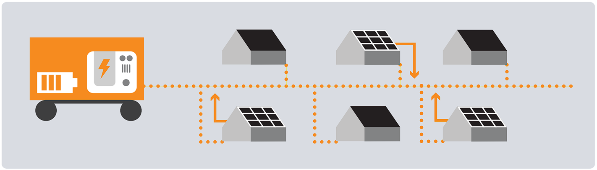
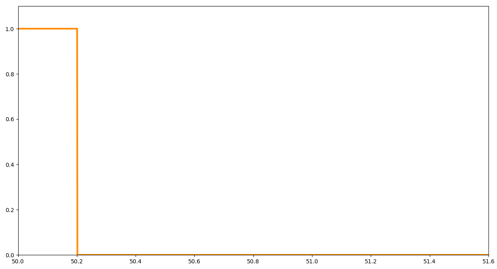
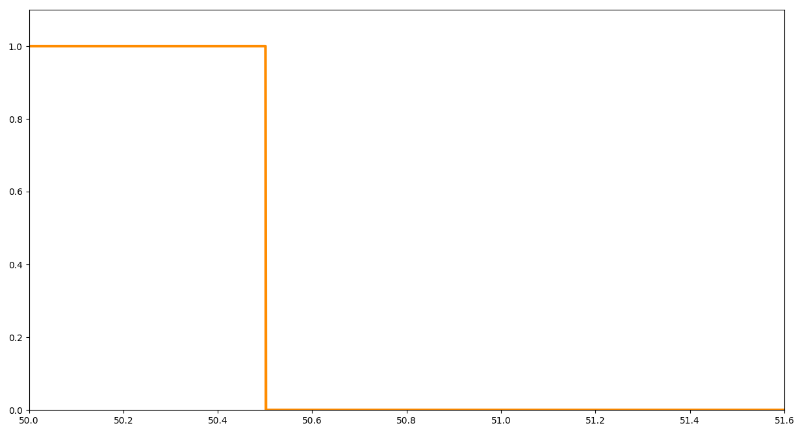
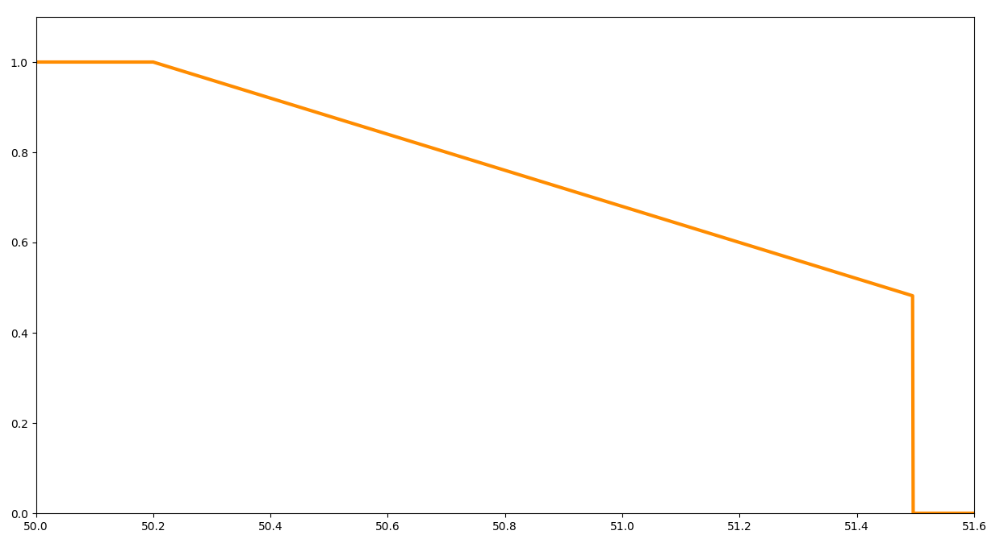
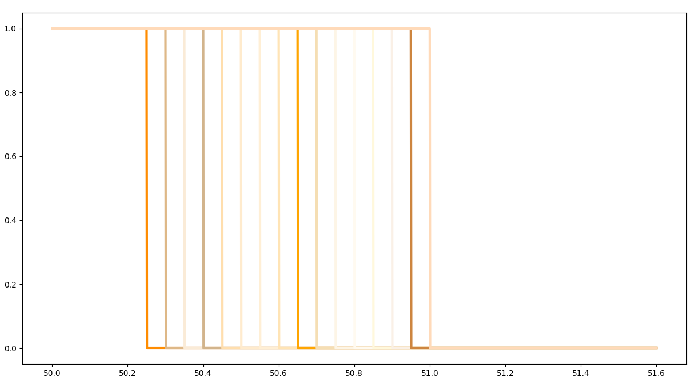

<h1 align="center">PV NORM PREDICTION</h1>

As a part of the project LINDA 2.0, several field test will be performed on low voltage grids composed of rooftop solar plants and housholds. During the last 20 years in Germany, several norms for connection of photovoltaic power plants have been proposed, whose field implementation have been a direct responsibility of the grid operators. This has led to lack of information regarding the norms that each of the connected solar power plants follow and its rated power. To be able to identify each solar power plant inside a low voltage grid, a machine learning algorithm has been developed in this work. 

# 🚀🔬😎 LINDA 2.0 🔎🔆🔋

The consequences of a long-lasting and widespread power blackout can approach a national catastrophe with serious consequences for civil society. The use of decentralized energy supply systems as an emergency supply for critical infrastructure using island grids can significantly reduce the damage in such scenarios. In the LINDA research project (local stand-alone grid supply and accelerated grid reconstruction with decentralized generation plants), a concept for stable stand-alone grid operation in the event of an emergency supply was developed and tested in a southern German grid area under real conditions. In LINDA 2.0, the LINDA concept will be transferred to another test area and (partially) automated. The object of investigation is a constellation of run-of-river power plant as an island network-forming unit and drinking water supply as critical infrastructure. Several field tests are planned. In addition, as part of the project, a hybrid unit is being developed and tested in the distribution network. The hybrid unit is intended to be an alternative to a conventional emergency power unit and consists of an inverter that forms an island grid with battery storage and a diesel generator as a range extender. In regular operation, the range extender is switched off and the unit works completely emission-free (noise, exhaust gas and CO2).

# ☀️🔋⚡ PV Norms  💡🌞🔌

As already mentioned, there are many norms for connection of photovoltaic power plants in germany, proposed over the last 20 years. Because we want to predict PV norms based on the behavior when the frequency is reduced, the following 4 PV norms are observed (Power per Unit over Frequency):

1. DIN V VDE V (2006)

2. VDEW 2001 (1991)

3. VDE4105 (2001/2005)

4. SysStab V (2012)

# 🤖⚙️🔧 Code | DNN 🦾👩‍💻💻
For the predicition of the PV-Norms, a deep neural network is been used. For the usage open the DNN folder in environment you wish and run the dnn.py file. 
Firstly, you will get asked if you want to Train, Test or Predict. 

## Train
If you type 'Train', you will train some parameters (weights, bias) for the neural network. After the code has finished, the resuts will get saved under DNN/parameters. For training, you will have to put some trainings data under DNN/DataSets. To generate some Data Sets, check [Data Simulation](📝🧾📂 Code | Data Simulation 📋📕⚙️)

# 📝🧾📂 Code | Data Simulation 📋📕⚙️
# 📝🧾📂 Code | Messdaten 📋📕⚙️

